# Sprout 設計変更点・現行／今後実装 設計図・フローチャート
> 初期のSprout構想・旧β設計から、2026年8月時点の製品方針、開発前仕様、MeteOmo連携、β版、将来構想を整理した公開用資料です。  

> 本資料では、共同開発上の個人名、連絡先、契約内部情報、非公開の個人的なやり取りは記載しません。

- 初期構想：2025年
- 本整理日：2026-08-28
- 現在の段階：開発前・共同開発者・運営者募集
- 初期公開対象：iPhone / iOSを第一候補
- 想定実装方式：React Native / TypeScript
- 開発方針：MeteOmoの現行開発環境・共同開発方式と近い構成を優先
- β版方針：β0公開デモ → β1クローズド実利用
- MeteOmo連携：本人が選択した情報のみ共有する方向
- 最終目標：学習・仕事体験・実績・支援・就労機会を接続する基盤・安定就労
- 主な設計配慮：**せかさない・無理をさせない・本人のペースを優先する・出来たことを確認しやすくする**
- 進行ペース：利用者本人が自己指定し、日ごと・活動ごとに変更できる方向
- 自己肯定感／自己効力感：完了だけでなく、着手・部分達成・工夫・学習したことも実績として残せる方向

---
## 1. この資料で使うステータス
| ステータス         | 意味                                           |
| ------------------ | ---------------------------------------------- |
| **開発前**         | 設計・共同開発者募集段階で、実装未着手のもの   |
| **β0予定**         | GitHub等で公開するダミーデータ中心のデモ版     |
| **β1予定**         | 利用者・支援者による少人数のクローズド実利用版 |
| **初期版必須**     | β確認後の初期公開版へ入れる候補                |
| **要調整／要決定** | 技術方式、保存、認証、UI等が未確定のもの       |
| **将来候補**       | 初期版には入れず、公開後に別途検討するもの     |
| **非目的**         | Sproutでは行わない判断・処理                   |

---
# 2. 初期構想からの大きな変更点
## 2.1 「広い福祉支援構想」から「学ぶ・試す・実績化する基盤」へ整理
### 初期構想
初期のSproutでは、以下を一つの大きな支援プラットフォームにまとめる構想がありました。

- AI学習
- ITスキル練習
- 模擬業務
- 小さな仕事
- ポートフォリオ
- 気分・体調・服薬記録
- 福祉制度情報
- 工賃・収入管理
- コミュニティ
- 支援者向け補助
- 他アプリ連携

### 現在
2026年8月版では、初期の中心を以下へ整理します。

> **本人が今できる範囲と、自分に合う進行ペースを確認し、学習・仕事・実績・収入・支援情報を、自分で確認できる形へまとめる。**

Sproutでは「早く進むこと」を成功条件にしません。利用者ごとに体調、経験、得意不得意、集中できる時間、生活環境が異なることを前提とし、**学習や作業のスピード感は利用者本人が決める**設計を基本とします。

基本構成は、

1. 今日できそうな活動量と、その日の進行ペースを本人が確認する

2. 学習またはタスクを選ぶ

   - Sprout内の教材・模擬タスク
   - 支援施設が登録した教材・課題・タスク
   - 外部学習サイトへのリンク
   - 外部サイトで学習した結果の登録

3. 小さな単位で学習・作業する

4. 施設・職場から依頼された仕事を「小さな仕事」として区分し、タスクとして管理する

5. 出来た内容・学習結果を実績カードへ残す

6. 必要な配慮を整理する

7. ポートフォリオと今後の目標を本人が整理する

8. 工賃・収入を本人用の管理シートで日々確認する

9. 本人が選んだ範囲だけ支援者へ共有する

10. 支援者からフィードバックや補助を受ける

11. 将来の就労・活動・外部ポートフォリオへつなげる

という流れです。

健康・気分・服薬等についてはSprout側で詳細な医療記録を重複して持たず、**MeteOmoから本人が選んだ項目のみ連携する**方向とします。

また、初期版から「模擬タスクだけ」に限定せず、**本人が所属する支援施設や職場等から実際に渡された小規模な依頼を、URL・依頼内容・期限・進捗・やり取りとともに本人のタスクとして管理する機能**を含めます。

ただし、Sprout運営が不特定多数へ求人・案件を仲介する公開マーケットプレイスや、Sprout内での報酬決済は将来候補として分離します。

---
## 2.2 「施設を同じにする」から「受けられる機会の差を小さくする」へ明確化
Sproutが直接、各福祉施設の工賃・賃金・設備・人員を同じ条件へ変更することはできません。

そのため、長期目標を以下のように整理します。

> **施設・地域・担当者によって、利用者が受けられる学習・仕事体験・情報・実績づくりの機会に大きな差が出る状態を、共通デジタル基盤によって可能な限りフラットにする。**

共通化する候補：

- 基礎教材
- 模擬タスク
- 実績カード
- 配慮整理
- 支援テンプレート
- 制度情報への入口
- ポートフォリオ形式

施設そのものの優劣を評価するランキングは目的としません。

---
## 2.3 開発基盤をMeteOmoに寄せる
### 旧設計
- Flutter
- iOS / Android
- ローカル中心
- APIなしでも動作するGitHubデモ

### 現在
Sproutはまだ開発前のため、MeteOmoの現行開発経験を流用しやすいよう、以下を第一候補とします。

| 項目           | 旧設計          | 2026年8月版                    |
| -------------- | --------------- | ------------------------------ |
| フレームワーク | Flutter         | **React Native**を第一候補     |
| 言語           | Dart            | **TypeScript**を第一候補       |
| 初期対象       | iOS / Android   | **iPhone / iOSを第一候補**     |
| Android        | 初期から想定    | **将来候補**                   |
| Web            | 将来候補        | **将来候補**                   |
| データ         | ローカル中心    | **ローカル中心＋β1で限定共有** |
| 認証           | デモでは不要    | **β1で導入候補**               |
| AI             | GPT前提の案あり | **β0では原則不要**             |

これは実装確定ではなく、共同開発開始時に技術レビューして最終決定します。

---
## 2.4 「せかさない・無理をさせない」ペース設計

Sproutでは、利用者の活動速度を一律に設定しません。

同じ教材・同じタスクでも、必要な時間、休憩回数、理解までの手順は利用者ごとに異なることを前提とします。

### 主な設計配慮

- **せかさない**
  - 「まだ終わっていません」「遅れています」等の圧迫的な表示を基本的に使わない
  - 連続利用日数や作業速度を競わせない
  - 他利用者との速度ランキングを作らない
  - 通知で作業を急かさない
- **無理をさせない**
  - 「今日は休む」「途中で止める」「後日に回す」を正常な選択肢として扱う
  - 作業を小さい単位へ分割できる（仮：チケット制度）
  - 途中保存を基本機能にする
  - 体調や集中状態に応じて、本人がその日の負荷を下げられる
- **本人のペースを優先する**
  - 進行ペースは本人が自己指定する
  - 日ごと・教材ごと・タスクごとに変更できる方向とする
  - 支援者はペースを提案できるが、本人の設定を一方的に上書きしない
  - MeteOmoの記録からSproutが自動的に「今日は働く／休む」を決定しない
- **自己肯定感・自己効力感につなげる**
  - 完了だけでなく「着手した」「一部できた」「前回より分かった」等も残せる
  - 未達・休息・途中終了を人格評価へ結びつけない
  - 出来たこと、工夫したこと、必要だった配慮を実績として記録する
  - 過剰な称賛ではなく、具体的な行動・工夫・進歩を本人が確認できる表示を重視する

### 利用者が自己指定する「進行ペース」

初期版では、速さの優劣を表すレベルではなく、本人が感覚的に選べる設定を検討します。

| 進行ペース | 表示例 | システム側の調整候補 |
|---|---|---|
| かなりゆっくり | 今日は少しずつ | タスク分割を細かくする、通知を減らす |
| ゆっくり | 余裕を持って進める | 短い作業単位を優先する |
| いつものペース | 普段の自分のペース | 本人の通常設定を使う |
| 今日は進められそう | 少し多めに進める | 本人が希望した場合だけ候補量を増やす |

「速いほど良い」という評価にはしません。

この設定は固定的な能力ランクではなく、**その日の状態や本人の希望に合わせて変えられる作業設定**として扱います。

### デフォルトと当日変更

- 本人が普段の進行ペースをデフォルトとして設定できる
- 当日はデフォルトと違うペースへ変更できる
- タスク単位でも「今日は細かく分ける」等を選べる
- 当日の設定を翌日へ自動固定しない
- 支援者への共有は本人が選択する

### 外部期限がある仕事との関係

施設・職場からの実際の仕事には期限があるため、本人のペース設定だけで外部の期限そのものを変更することはできません。

期限と現在のペースが合わない場合は、

- タスクを分割する
- 優先順位を整理する
- 支援者へ相談する
- 依頼元と作業量や期限を調整する

ための導線を出します。

「急いでください」と圧迫するのではなく、

> このペースでは期限までに難しい可能性があります。作業量や期限を支援者と確認できます。

のように、**状況と次の選択肢を事実として示す**方向とします。

**ステータス：β1／初期版の基本設計原則。**

---

# 3. β版の考え方を2段階へ変更
## 3.1 β0：GitHub公開デモ版
β0は、安全に公開できるUI/UXプロトタイプです。

使用するもの：

- 架空利用者
- 架空支援者
- 架空施設
- 模擬タスク
- 模擬実績
- 模擬フィードバック
- 模擬MeteOmo連携データ
- 模擬PDF

使用しないもの：

- 実個人情報
- 実健康情報
- 実施設情報
- 実求人
- 実企業案件
- 実決済
- 実MeteOmo記録
- APIキー
- シークレット

### β0フロー
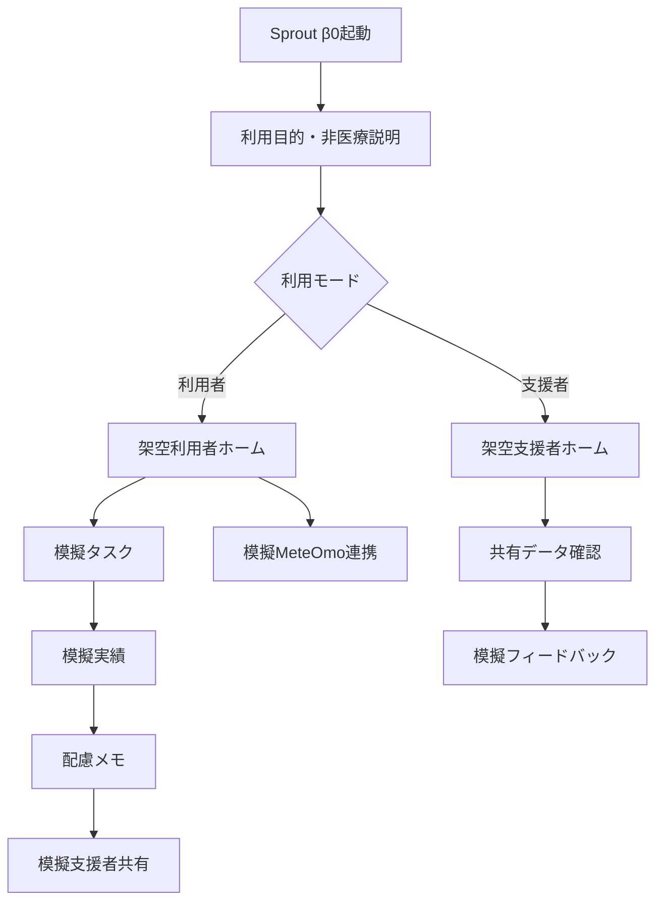

**ステータス：β0予定。**

---
## 3.2 β1：クローズド実利用版
β1では、少人数の利用者と支援者が別々の役割で使える状態を目指します。

### 利用者側
- 今日の状態・活動可能量
- 本人指定の進行ペース
- 学習
- 模擬タスク
- 完了記録
- 実績カード
- 配慮メモ
- 支援者共有
- 支援者フィードバック
- PDF
- MeteOmo任意連携

### 支援者側
- 招待された利用者のみ表示
- 本人が共有した項目のみ閲覧
- 模擬タスク提案
- フィードバック
- 配慮メモ確認
- 支援メモ
- レポート
- 共有解除対応

### β1フロー
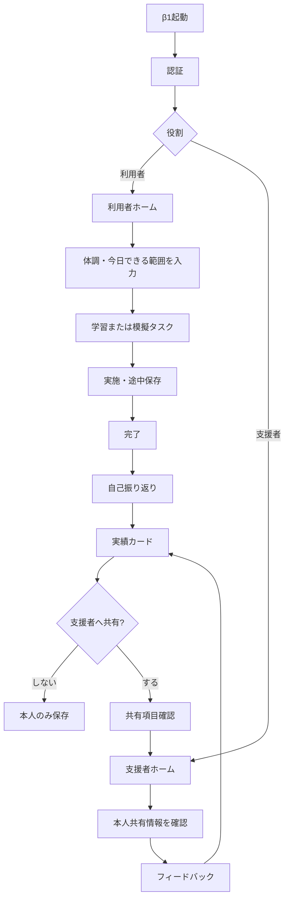

**ステータス：β1予定。**

---
# 4. 利用者機能
## 4.1 今日の状態・活動可能量・進行ペース

Sproutでは医療記録を重複して詳細入力させず、学習・就労支援に必要な最小限へ絞ります。

入力候補：

- 今日は活動できそう
- 少しならできそう
- 休みたい
- 作業可能時間
- 集中しやすさ
- 対人負担
- **今日の進行ペース**
  - かなりゆっくり
  - ゆっくり
  - いつものペース
  - 今日は進められそう
- 任意メモ

進行ペースは本人が選択し、後から変更できる方向とします。

前日のペースや支援者の判断を自動的に固定するのではなく、**「今日はどう進めたいか」**を本人が決められる設計を基本とします。

### フロー

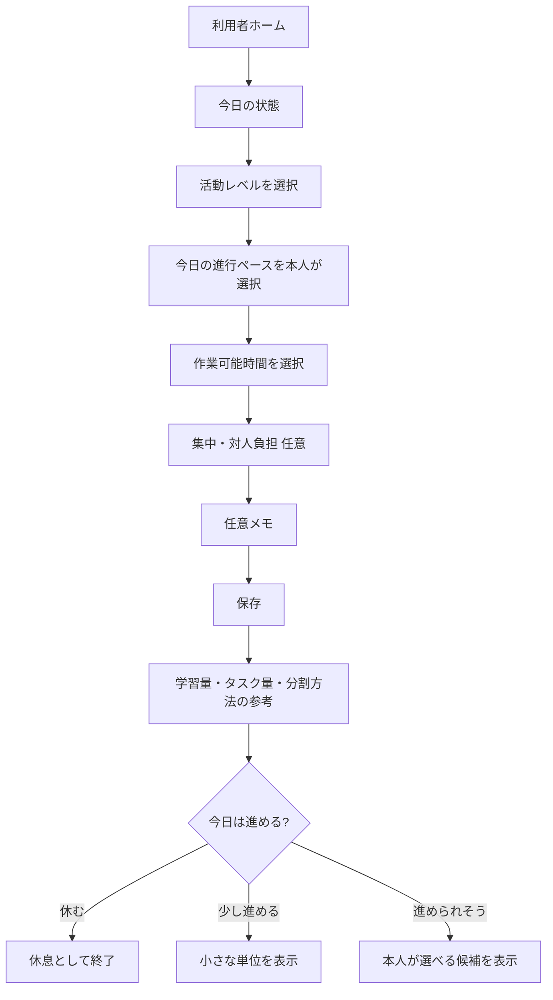

### ペース設定の扱い

- 本人の能力ランクとして保存しない
- 支援者評価の点数に使わない
- 他利用者と比較しない
- 就労可否の自動判定に使わない
- 本人が希望する場合だけ支援者へ共有する
- 「休む」を選んでも未達・失敗として扱わない
- MeteOmoから連携した気分・体調・服薬情報だけでSproutがペースを自動決定しない

**ステータス：β1予定／初期版必須候補。**

---
## 4.2 学習
学習機能は、Sproutが用意した教材だけを使う方式には限定しません。

初期版では、以下の3つの入口を想定します。

1. **Sprout内教材・模擬教材**

2. **支援施設・支援者が登録した教材・課題**

3. **外部学習サイト・講座・動画・教材**

### 初期教材候補
- PC基本操作
- ファイル管理
- メール基礎
- 文書作成
- Excel / 表計算
- Web検索
- AI活用基礎 / 応用 / 著作権 / 知的財産
- HTML / CSS / 他言語プログラミング / 設計
- 画像編集 / デザイン / イラスト
- 動画編集
- 情報セキュリティ
- アナリティクス
- 語学 / ライティング
- その他資格取得支援

### 支援施設・支援者による教材登録
支援者側から、

- 教材名
- 説明
- 対象利用者
- URL
- ファイル
- 所要時間
- 難易度
- 完了条件
- 補足
- 期限

等を登録できる簡易機能をβ版から検討します。

施設独自の研修、作業マニュアル、外部講座等も、Sprout上で一つの学習一覧として整理できることを目指します。

### 外部サイト学習結果の登録
Sprout外で学習した場合も、本人が結果を残せるようにします。

登録候補：

- 学習サービス名
- 教材・講座名
- URL
- 実施日
- 学習時間
- 修了状態
- 本人メモ
- 証明書・成果物URL
- 支援者への共有可否

外部サイトのアカウント情報やパスワードをSproutへ保存することは前提としません。

### 学習フロー
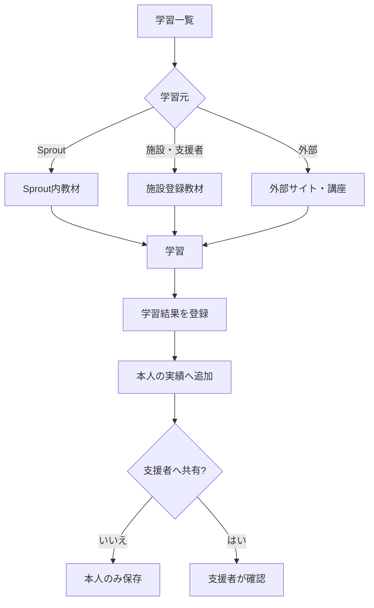

### オリジナル教材作成者募集（将来）
将来的には、Sprout内で利用できるオリジナル教材について、

- IT
- ライティング
- デザイン
- 事務
- 生活スキル
- 就職準備
- その他の職業訓練

等の分野で教材作成者を募集し、内容確認・権利処理・更新管理を行った上で提供する仕組みを検討します。

教材の人気ランキングだけで価値を決めるのではなく、対象者・難易度・アクセシビリティ・更新日等を明示する方向とします。

**ステータス：施設教材登録・外部学習結果登録はβ1／初期版候補。Sproutオリジナル教材作成者募集は将来候補。**

---
## 4.3 学習タスク・模擬タスク
Sprout内では、練習用の模擬タスクを用意します。

例：

- 誤字チェック
- 短い文章作成
- データ入力
- 表整理
- 画像リサイズ
- バナー模擬制作
- HTML修正
- 簡単なリサーチ
- ファイル整理
- 商品説明文作成

タスク情報：

- タイトル
- カテゴリ
- 難易度
- 想定時間
- 必要スキル
- 作業指示
- 提出方法
- 配慮ポイント
- 推奨する作業分割単位
- 本人の進行ペースに合わせた表示候補
- サンプル
- 完了条件

### 模擬タスクフロー
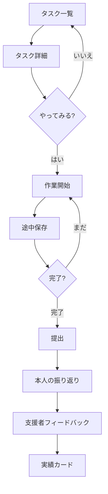

### 途中終了・部分達成

タスクは「完了／失敗」の二択にしません。

候補：

- 着手した
- 一部まで進めた
- 分からない箇所を確認した
- 支援を受けて進めた
- 今日はここまで
- 完了した

途中で止めても、それまでの進捗や学んだ内容を記録できる方向とします。

**ステータス：β0予定／β1予定。**

---
## 4.4 小さな仕事・施設／職場タスク管理
初期版から、Sprout運営が用意する模擬タスクだけでなく、**本人が所属する施設・職場・支援者等から実際に受け取った小さな仕事や依頼を、本人のタスクとして管理する機能**を含めます。

これは公開求人マーケットではなく、すでに本人と関係のある施設・職場等から渡された仕事を整理する機能です。

### 登録候補
- 依頼元の表示名
- タスク名
- 依頼内容
- 元ページ・社内ページ等のURL
- 添付・参考リンク
- 依頼日
- 期限
- 優先度
- 想定時間
- 作業状況
- 提出先
- 本人メモ
- 支援者共有可否

### 状態候補
- 未着手
- 作業中
- 確認待ち
- 修正中
- 完了
- 保留

### やり取り管理
Sprout内で、タスク単位に必要なやり取りを整理する候補です。

- 支援者からの補足
- 依頼内容の更新
- 修正依頼
- 本人からの確認事項
- 完了報告
- 関連URL

外部チャットやメールそのものを無断取得するのではなく、**本人・支援者が必要な内容を登録する方式**を初期候補とします。

### フロー
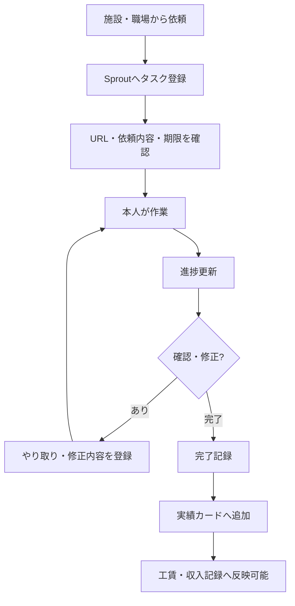

Sproutが不特定多数の利用者へ実求人を仲介する機能や、Sprout内で報酬を決済する機能は初期版に含めません。

### ペースと期限の調整

実仕事では期限を消すことはできませんが、Sprout側では利用者を急かすのではなく、

- 現在の進捗
- 残り作業
- 本人が選んだ進行ペース
- 期限までの日数
- 支援者への相談
- 作業量・期限の再調整候補

を確認できる方向とします。

期限に間に合わない可能性がある場合も、「遅い」「急げ」と評価せず、早めに相談・再調整へつなげます。

**ステータス：β1簡易版／初期版必須候補。**

---
## 4.5 実績カード
模擬業務でも、出来た内容をその場限りにしないための記録です。

候補：

- タスク名
- 実施日
- 作業時間
- 完了内容
- 使用したスキル
- 本人コメント
- 必要だった配慮
- 支援者コメント
- 再挑戦希望
- 外部公開可否

β版では自動公開しません。

また、実績カードは「完了した成果」だけでなく、本人が希望する場合は、

- 初めて着手できた
- 一部まで進めた
- 新しく理解できた
- 工夫して進められた
- 支援や配慮があれば出来た
- 前回より負担が少なかった

といった変化も残せる方向とし、**自分の出来ることや出来る条件を本人が確認しやすくする**ことを重視します。

**ステータス：β0予定／β1予定。**

---
## 4.6 配慮メモ
診断名ではなく、「どの条件なら作業しやすいか」を本人が整理します。

例：

- 30分ごとに休憩があると作業しやすい
- 口頭指示より文章の方が理解しやすい
- 急な変更が負担になる
- 電話対応は難しい
- 在宅の方が集中しやすい
- 午後の方が作業しやすい
- 同時に複数の指示があると混乱しやすい

### 共有フロー
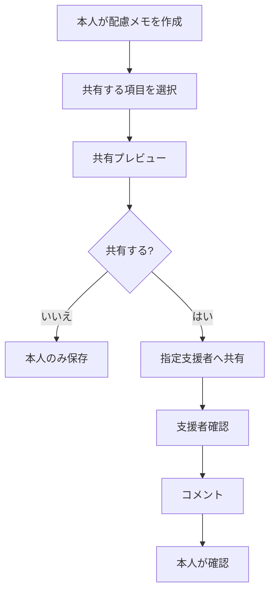

**ステータス：β1予定。**

---
## 4.7 ポートフォリオ・目標シート
初期版から、本人が「出来たこと」と「これからやりたいこと」を自分で整理できる機能を含めます。

### Sprout内ポートフォリオ
本人が実績カード等から、掲載する項目を自分で選択します。

候補：

- 学習実績
- 模擬タスク
- 小さな仕事
- 制作物
- 使用できるツール
- 得意な作業
- 支援者から共有されたフィードバック
- 本人コメント
- 外部公開可否

全実績が自動公開される設計にはしません。

ポートフォリオは高い成果だけを並べる場所に限定せず、本人が希望する場合は、

- 初めて出来たこと
- 続けられたこと
- 工夫して出来たこと
- 支援や配慮があれば出来たこと
- 学習途中でも身についたこと

等も選択して残せるようにし、自己肯定感・自己効力感を損ないにくい設計を目指します。

### 外部ポートフォリオへのリンク支援
本人がすでに利用している外部サービスへのリンクを整理できるようにします。

例：

- GitHub
- 個人サイト
- WordPress
- note等の記事ページ
- 外部ポートフォリオサービス
- クラウドストレージ上の本人公開資料

Sproutが外部サービスのID・パスワードを預かることは前提としません。

### 目標シート
本人が、

- 今後やりたいこと
- 学習したいこと
- 試してみたい作業
- 将来したい仕事
- 働き方の希望
- 今は避けたいこと
- 必要な配慮
- 次に試す小さな目標

を整理できるシートを用意します。

目標は支援者が一方的に設定するのではなく、本人が作成・修正し、共有範囲を選べることを基本とします。

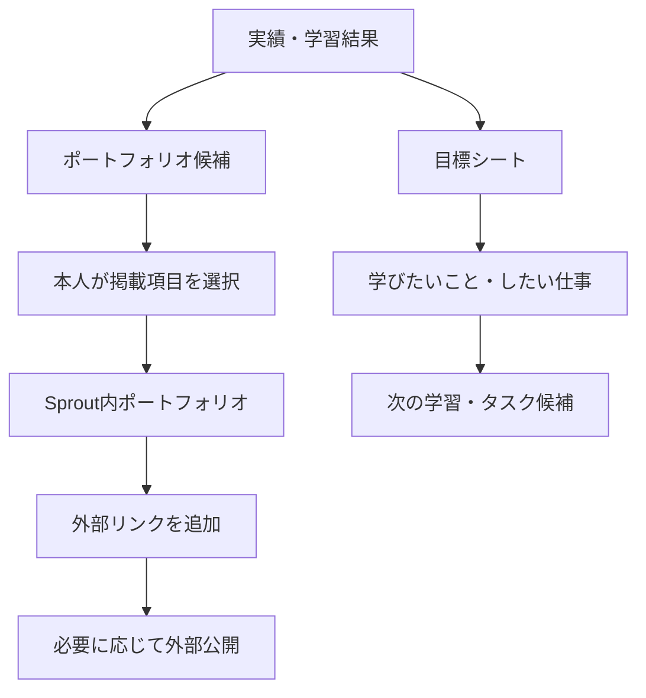

**ステータス：β1簡易版／初期版必須候補。**

---
## 4.8 工賃・収入 個人管理シート
初期版では、Sproutが給与計算や工賃支払いを行うのではなく、**利用者本人が自分の工賃・収入を日々確認するための個人管理シート**を提供します。

### 初期版の記録候補
- 日付
- 施設・仕事区分
- タスク名
- 作業時間
- 件数
- 工賃・報酬額
- 交通費等の任意メモ
- 月間合計
- 本人メモ

### 表示候補
- 今月の工賃・収入
- 前月との比較
- 作業時間
- タスク別金額
- 時間あたり参考額
- 月別推移

「もっと働くべき」という評価や、低収入を本人の努力不足とする表示は行いません。

### 将来の施設・支援者連携
将来的には、本人が許可した場合、

- 施設側が登録した作業実績
- 工賃情報
- 支援者側の確認情報

をSprout内で連携し、本人の手入力負担を減らすことを検討します。

ただし、本人が自分の工賃・収入を日々確認できる状態を維持します。

### 比較機能
将来的には、

- 同種施設の公開工賃情報
- 地域別の公開統計
- 一般市場の参考単価
- 同種作業の参考価格

等と比較できる機能を検討します。

比較データには、

- 出典
- 対象年
- 地域
- 雇用形態
- 作業条件

を明示し、単純な優劣ランキングにはしません。

**ステータス：本人用個人管理シートはβ1簡易版／初期版必須候補。施設連携・外部比較は将来候補。**

---
# 5. 支援者機能
## 5.1 支援者ホーム
表示候補：

- 招待済み利用者
- 本人が共有した今日の状態
- 最近完了したタスク
- フィードバック待ち
- 配慮メモ
- 支援メモ
- レポート

支援者が利用者の全データを自動的に閲覧できる設計にはしません。

本人の進行ペースについても、本人が共有を選択した場合に限り確認できる方向とします。支援者は作業量・期限・進め方を提案できますが、**本人のペースを一方的に「遅い」「もっと速く」と評価したり、設定を上書きしたりする用途にはしません。**

---
## 5.2 支援者フロー
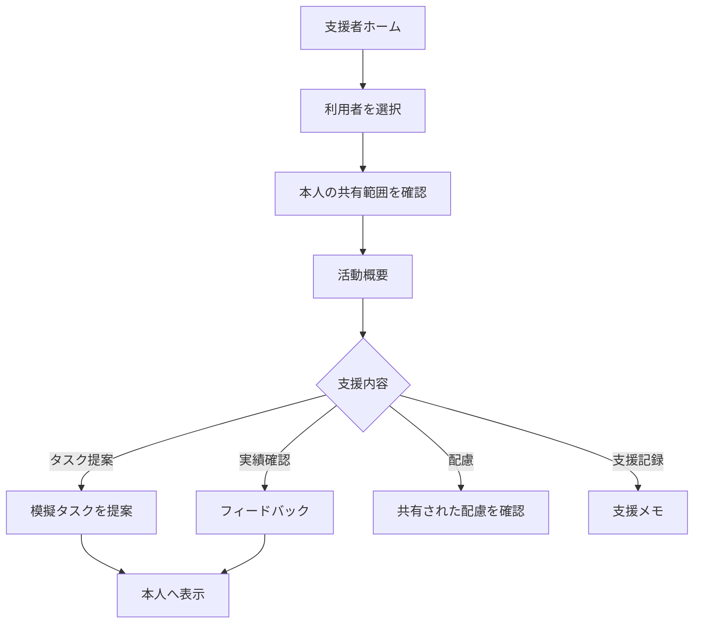

**ステータス：β1予定。**

---
## 5.3 支援メモ
候補：

- 面談日
- 実施した支援
- 次回確認事項
- 本人から共有された希望
- タスク提案理由

センシティブ情報を必要以上に記録しない運用を前提とします。

**ステータス：β1予定／要調整。**

---
## 5.4 支援者向け補助（β簡易版）
β版から、支援者側にも最低限の補助機能を用意します。

候補：

- 施設教材・外部教材URLの登録
- 利用者へ学習タスクを提案
- 外部学習結果の確認
- 施設・職場の小さな仕事をタスク登録
- 依頼内容・期限の更新
- タスク単位の補足・修正依頼
- 実績へのフィードバック
- 本人が共有した配慮の確認
- 目標シートへのコメント
- 本人が共有した工賃・収入情報の確認
- PDFレポート作成補助
- 本人が共有した進行ペースの確認
- ペースに合わせたタスク分割・学習量の提案
- 「今日はここまで」「休む」を前提にした予定調整

支援者が本人の全記録を自由に編集・閲覧する機能にはしません。

βでは機能を絞り、**「登録・確認・フィードバック・共有」**を中心とします。

**ステータス：β1予定／初期版必須候補。**

---
# 6. MeteOmoとの連携
## 6.1 役割分担
### MeteOmo
- 気分
- 服薬記録
- 天気
- 気圧
- 任意メモ
- 日々のセルフモニタリング

### Sprout
- 活動可能範囲
- 学習
- 模擬業務
- 実績
- 配慮
- 支援者共有
- 就労準備

---
## 6.2 連携方針
MeteOmoの記録をSproutへ常時自動送信することは前提としません。

本人が共有する情報を選びます。

候補：

- 気分記録のうち本人が選択した項目
- 体調・生活状況のうち本人が選択した項目
- 服薬記録のうち本人が共有すると選んだ状態
- 今日の状態
- 本人が選んだ活動可能レベル
- 本人が共有したい短いメモ
- 選択期間の簡易サマリー

初期連携では、MeteOmoの全データを複製するのではなく、**本人がSproutでの学習・作業・支援に必要だと判断した項目だけを選択して連携する**方向とします。

MeteOmoから共有された気分・体調・服薬等を根拠に、Sproutが自動的に「今日は働くべき」「休むべき」と決定することはしません。進行ペースや活動量の最終選択は本人に残します。

初期共有から除外する候補：

- 薬名一覧
- 詳細な服薬履歴
- 正確な位置情報
- 医療機関情報
- 詳細な医療メモ
- 本人が共有を選んでいない自由記述

---
## 6.3 MeteOmo → Sproutフロー
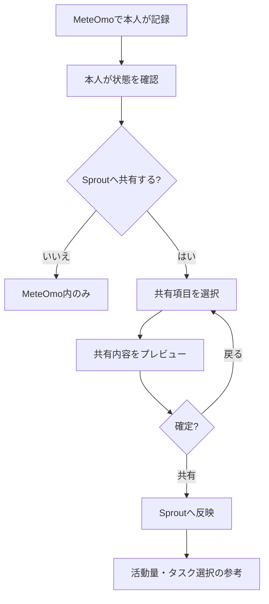

β0ではダミー連携のみ。

β1では**本人が都度共有する方式**を第一候補とします。

**ステータス：β0はモック予定／β1は要技術決定。**

---
# 7. PDF・レポート
## 7.1 利用者向け
本人が選択した期間について、

- 実施タスク
- 作業時間
- 出来たこと
- 使用スキル
- 配慮
- 本人コメント
- 支援者コメント

を整理します。

## 7.2 支援者向け
本人の許可範囲で、

- 活動状況
- 完了タスク
- 得意になりつつある作業
- 負担が大きかった作業
- 必要な配慮
- 次に試す候補

を整理します。

### フロー
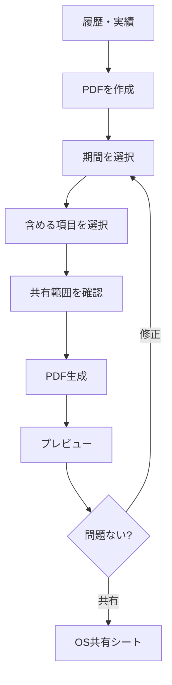

### 非目的
- 能力証明書ではない
- 採用保証ではない
- 医療文書ではない
- 障害認定資料ではない
- 就労可否判定書ではない

**ステータス：β1予定／初期版必須候補。**

---
# 8. AIの扱い
## 8.1 β0
AI APIを必須にしません。

固定教材・固定サンプルで動作確認します。

## 8.2 β1以降
導入候補：

- 説明の言い換え
- 練習問題
- 作業指示の簡易化
- 文書整理
- 支援者向け教材案

AIにさせないこと：

- 「この仕事に向いていない」
- 「就職できます」
- 「障害が重いです」
- 「この制度を受給できます」
- 「今日は働けます」
- 医療・服薬判断
- 本人の価値・能力の自動評価
- 作業速度だけを根拠にした能力評価
- 「もっと急ぐべき」「休まず続けるべき」等の圧迫的な自動助言

**ステータス：β0除外／β1以降の限定候補。**

---
# 9. 制度ナビ
制度情報は、**公的情報への入口**として扱います。

候補：

- 就労継続支援A型
- 就労継続支援B型
- 就労移行支援
- 障害者雇用
- ハローワーク等の就労相談
- その他の公的相談先

表示しない例：

- 「あなたはA型対象です」
- 「障害年金○級です」
- 「生活保護を受けられます」
- 「この制度なら必ず利用できます」

### 簡易福祉制度マップ
初期版から、制度名の一覧だけでなく、利用者が「どこへ相談すればよいか」を把握しやすい簡易マップを用意する方向とします。

候補：

- 就労支援
- 生活支援
- 医療・相談
- 障害者雇用
- 公的就労相談
- 自治体窓口

表示内容候補：

- 制度・窓口名
- 簡単な説明
- 対象地域
- 公式URL
- 地図上の位置または住所
- 情報更新日

Sproutが受給可否や利用資格を判定するものではありません。


**ステータス：制度一覧・簡易マップは初期版候補／掲載範囲・データ更新方法は要決定。**

---
# 10. データ・共有権限
## 10.1 利用者
- 自分の記録を閲覧
- 編集
- 削除
- エクスポート
- 支援者共有ON/OFF
- 共有範囲選択
- 共有解除

## 10.2 支援者
- 招待された利用者のみ
- 本人が共有した項目のみ閲覧
- 非共有項目は閲覧不可

## 10.3 運営・開発
初期版では、利用者の詳細健康記録を開発者が一括閲覧する管理画面は設けない方向です。

エラー解析等に必要な最小限の情報は、実装前に別途定義します。

---
# 11. データ構造（概念）
## 利用者
```text

User

- id

- role

- displayName

- createdAt

- consentVersion

- sharingSettings

```

## 今日の活動状態
```text

DailyCapacity

- id

- userId

- date

- activityLevel

- availableMinutes

- concentrationLevel

- socialLoad

- paceLevel

- memo

```

## 進行ペース設定

```text
PacePreference
- id
- userId
- defaultPace
- dailyOverride
- taskChunkPreference
- reminderFrequency
- shareWithSupporter
- updatedAt
```

`paceLevel` / `PacePreference` は能力評価ではなく、本人が作業量や表示方法を調整するための設定として扱います。

## タスク
```text

Task

- id

- title

- category

- difficulty

- estimatedMinutes

- instructions

- requiredSkills

- completionCriteria

- isMock

```

## タスク実績
```text

TaskResult

- id

- userId

- taskId

- startedAt

- completedAt

- actualMinutes

- selfReview

- supporterFeedback

- accommodationsUsed

```

## 配慮
```text

Accommodation

- id

- userId

- category

- text

- shareEnabled

- updatedAt

```

## MeteOmo共有サマリー
```text

MeteOmoShare

- id

- userId

- sharedAt

- selectedItems

- summary

- sourceVersion

- expiresAt

```

**ステータス：概念設計／実装時にDB仕様を確定。**

---
# 12. セキュリティ・プライバシー
初期必須候補：

- 通信暗号化
- ローカル保存保護
- 認証
- 利用者／支援者の権限分離
- 共有前確認
- データ削除
- アカウント削除
- ログアウト
- センシティブ情報を任意入力にする
- 本人同意
- 共有解除
- 不要データを収集しない

β0では実データを扱わないため、本番用の認証・クラウドは不要です。

β1開始前に、認証・バックエンド・保存地域・削除・アクセス制御を決定します。

---
# 13. オフライン
可能な範囲でオフライン利用を維持します。

候補：

- 模擬タスク閲覧
- 作業記録
- 配慮メモ
- 下書き
- 保存済み教材

オンライン復帰時の共有については、本人へ同期対象を確認できる構成を優先します。

**ステータス：要技術決定。**

---
# 14. アクセシビリティ
初期から考慮する候補：

- 文字サイズ拡大
- VoiceOver
- 色だけに依存しない状態表示
- 十分なコントラスト
- 大きめの操作領域
- アニメーション削減
- 1画面1目的を基本
- 難しい制度用語へ説明を付ける
- エラー文を簡潔にする

**ステータス：初期版必須候補。**

---
# 15. 通知

通知は初期OFFまたは本人の明示設定を基本とします。

候補：

- 支援者からのフィードバック
- 提案された模擬タスク
- 本人が設定した予定
- 本人が希望した期限確認

避けるもの：

- 「今日はまだ作業していません」
- 「連続記録が途切れます」
- 「もっと働きましょう」
- 「遅れています。急いでください」
- 「他の利用者より進捗が遅いです」

期限がある場合は焦らせる表現ではなく、**期限・現在の進捗・相談や再調整の選択肢**を表示します。

通知頻度も本人が選択できる方向とし、「通知しない」を通常の設定として扱います。

---
# 16. β1受入条件
以下を満たしてから実利用βへ進みます。

| 条件                                                       | 必須     |
| ---------------------------------------------------------- | -------- |
| アプリが安定起動する                                       | 必須     |
| 利用者／支援者の権限が分離される                           | 必須     |
| 本人共有なしに支援者が閲覧できない                         | 必須     |
| 模擬タスクを完了できる                                     | 必須     |
| フィードバックできる                                       | 必須     |
| データ削除できる                                           | 必須     |
| 共有解除できる                                             | 必須     |
| PDF生成できる                                              | 必須候補 |
| MeteOmo連携をOFFにできる                                   | 必須     |
| MeteOmo非利用者でもSprout単体で使える                      | 必須     |
| 医療・制度判定を行わない                                   | 必須     |
| 不特定多数向けの求人仲介・Sprout内決済が入っていない       | 必須     |
| 施設・職場から本人へ提供された小さな仕事をタスク管理できる | 必須候補 |
| 外部学習結果を本人が登録できる                             | 必須候補 |
| 本人用の工賃・収入シートを確認できる                       | 必須候補 |
| 本人が進行ペースを自己指定・変更できる | 必須候補 |
| 「休む」「途中まで」を失敗扱いしない | 必須 |
| 支援者が本人のペースを一方的に変更できない | 必須 |
| 作業速度ランキング・連続利用圧力がない | 必須 |

---
# 17. 初期公開版 v1.0
β1後の初期公開版では、以下を基本機能候補とします。

## 利用者
- 今日の状態・活動可能量
- 本人指定の進行ペース・作業量調整
- Sprout内学習
- 支援施設が登録した教材・課題
- 外部学習サイトへのリンク
- 外部学習結果の登録
- 模擬スモールワーク
- 施設・職場からの小さな仕事のタスク管理
- URL・依頼内容・期限・進捗・やり取り管理
- 実績カード
- 配慮メモ
- Sprout内ポートフォリオ
- 外部ポートフォリオリンク整理
- 今後やりたいこと・学びたいこと・したい仕事の目標シート
- 工賃・収入の本人用管理シート
- 福祉制度情報・簡易マップ
- 支援者共有
- PDF
- MeteOmoから本人が選んだ気分・体調・服薬等の項目を任意連携
- その他アプリとの本人選択型連携を可能な範囲で検討

## 支援者
- 利用者招待
- 本人共有情報確認
- 施設教材・外部教材URL登録
- 学習・タスク提案
- 外部学習結果の確認
- 小さな仕事の登録・更新
- 依頼内容・期限・やり取り補助
- 実績へのフィードバック
- 目標シートへのコメント
- 本人が共有した工賃・収入情報の確認
- 支援メモ
- レポート

---
# 18. 初期版から外すもの
| 機能                                                 | 現在の扱い         |
| ---------------------------------------------------- | ------------------ |
| 不特定多数向けの公開求人・案件仲介                   | 将来候補           |
| Sprout内での報酬支払い・決済                         | 将来候補           |
| 施設・職場から本人へ提供された小さな仕事のタスク管理 | **初期版に含める** |
| 本人用の工賃・収入記録                               | **初期版に含める** |
| 施設・支援者との工賃情報自動連携                     | 将来候補           |
| 全国施設データベース                                 | 将来候補           |
| 福祉制度の簡易マップ                                 | **初期版候補**     |
| SNS型コミュニティ                                    | 将来候補           |
| AIによる能力評価                                     | 非目的             |
| AIによる就労可否判断                                 | 非目的             |
| 自動MeteOmo常時同期                                  | 初期版除外         |
| 詳細な服薬データ共有                                 | 初期版除外         |
| 研究目的データ提供                                   | 初期版除外         |
| センシティブ情報の広告利用                           | 非目的             |
| 利用者ランキング                                     | 非目的             |
| 施設ランキング                                       | 非目的             |
| 利用者の作業速度ランキング | 非目的 |
| 休息・途中終了へのペナルティ | 非目的 |
| 本人同意なしのペース自動変更 | 非目的 |

---
# 19. 今後の実装候補
## 19.1 実案件マーケット
将来的には、企業・事業所等が、

- 短時間
- 在宅可能
- 手順明確
- 分割可能
- 配慮条件明記

の仕事を掲載できる仕組みを検討します。

必要な安全設計：

- 最低報酬基準
- 無償労働禁止
- 不当な買いたたき防止
- 作業内容審査
- 違法・危険業務禁止
- 不要な個人情報要求禁止
- 支払い保証
- キャンセル規則
- 苦情処理
- 利用者保護

**ステータス：長期構想。**

---
## 19.2 工賃・収入管理の拡張
本人用の工賃・収入管理シートは初期版へ入れる方向とします。

初期版：

- 本人による入力
- 月間合計
- 作業時間
- タスク別金額
- 月別推移

将来候補：

- 支援者・施設側ページとの連携
- 施設側の実績登録から本人シートへ反映
- 入力負担の軽減
- 公開されている他施設の工賃統計との比較
- 地域別比較
- 一般市場の参考単価との比較
- 同種作業の参考価格表示

比較は「本人・施設の優劣」を決めるランキングではなく、**現在の工賃や作業単価を本人が理解するための参考情報**として扱います。

出典・年度・条件が異なるデータを単純に同一視しない設計が必要です。

**ステータス：個人管理シートは初期版候補。施設連携・外部比較は将来候補。**

---
## 19.3 施設向け機能
候補：

- 利用者管理
- 共通教材
- 模擬タスク配布
- 支援記録
- 実績管理
- 配慮整理
- 面談資料
- PDF
- 引き継ぎ
- 施設内学習進捗

**ステータス：将来候補。**

---
## 19.4 施設間の機会差縮小
施設ごとに設備・担当者の専門分野が異なっても、Sproutにアクセスできれば、

- 同じ基礎教材
- 同じ模擬タスク
- 同じ実績形式
- 同じポートフォリオ形式
- 同じ制度情報入口

を利用できる状態を目指します。

**ステータス：長期目標。**

---
## 19.5 ポートフォリオの拡張
ポートフォリオの基本機能は初期版から導入します。

初期版：

- Sprout内ポートフォリオ
- 実績カードから本人が掲載項目を選択
- 外部ポートフォリオへのリンク整理
- 目標シート

将来候補：

- 公開用Webページ生成
- GitHub等との連携補助
- WordPress等への出力補助
- PDF
- CSV / JSON
- 支援者と共同での公開前レビュー
- 施設内実績から本人ポートフォリオへの選択転記

本人が公開範囲を選択し、健康情報・配慮情報等を自動公開しない設計を維持します。

**ステータス：基本機能は初期版。公開・外部出力拡張は将来候補。**

---
## 19.6 コミュニティ
一般SNSのような、

- フォロワー競争
- いいね競争
- 人気ランキング

は中心にしません。

候補：

- 質問
- 情報交換
- 小さな相談
- 「これなら教えられる」
- 制作物共有

**ステータス：将来候補。初期版・β版ではコミュニティ機能を必須にしません。**

---
## 19.7 Lapiaとの連携
本人が希望する場合に限り、Sproutでの学習・仕事・社会参加に伴う孤独や対人負担について、匿名対話支援Lapiaへ移動できる導線を検討します。

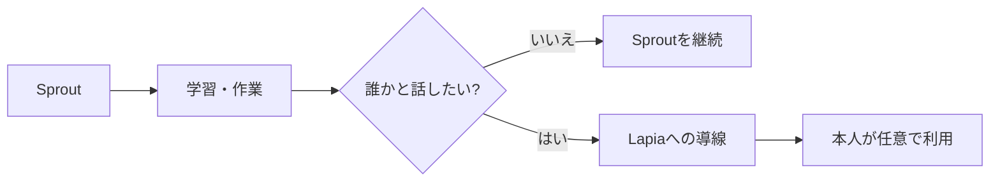

Sprout上の就労・健康情報や、Lapia上の会話内容を自動共有することは前提としません。

**ステータス：長期構想。**

---
## 19.8 他アプリ・外部サービスとの連携
Sproutは、本人がすでに利用しているサービスや、今後必要になるアプリと連携できる余地を残します。

基本原則：

- 本人が連携するか選択する
- 必要な範囲だけ共有する
- 連携しなくてもSprout単体で利用できる
- アカウントのパスワードをSproutへ直接保存することを前提としない
- 外部サービスの規約・API条件を確認する
- 健康情報等のセンシティブ情報は自動共有しない

初期版で想定する軽い連携：

- MeteOmoの選択共有
- 外部学習サイトへのURL
- 外部学習結果の手動登録
- 外部ポートフォリオURL
- 施設・職場のタスクURL

将来候補：

- 対応サービスのAPI連携
- 学習完了情報の自動取り込み
- ポートフォリオへの成果物反映
- 支援施設システムとの限定連携

**ステータス：リンク・手動登録は初期版候補。API等の自動連携は将来候補。**

---
# 20. 最終版の将来像
最終的なSproutは、単なる記録・教材アプリではなく、

> **学習・就労準備・仕事経験・実績・支援・収入機会を接続する基盤**

を目指します。

### 最終版利用者フロー
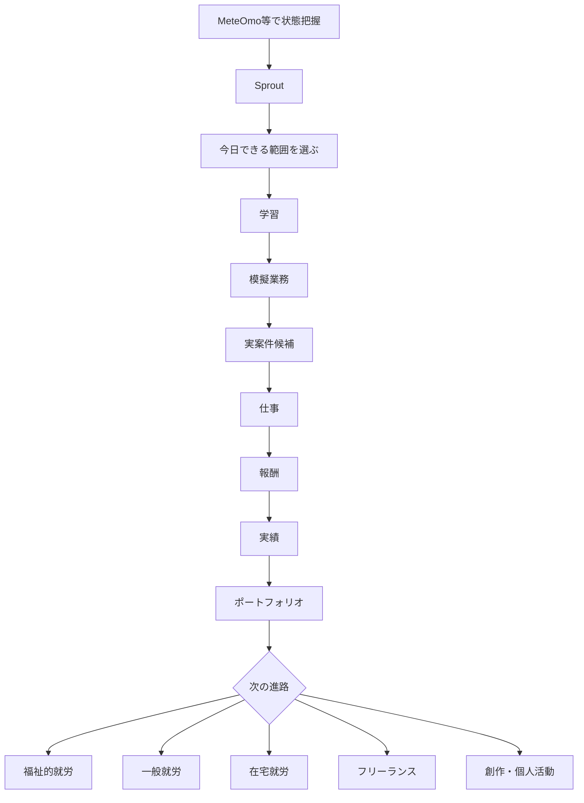

---
# 21. 最終版全体構成
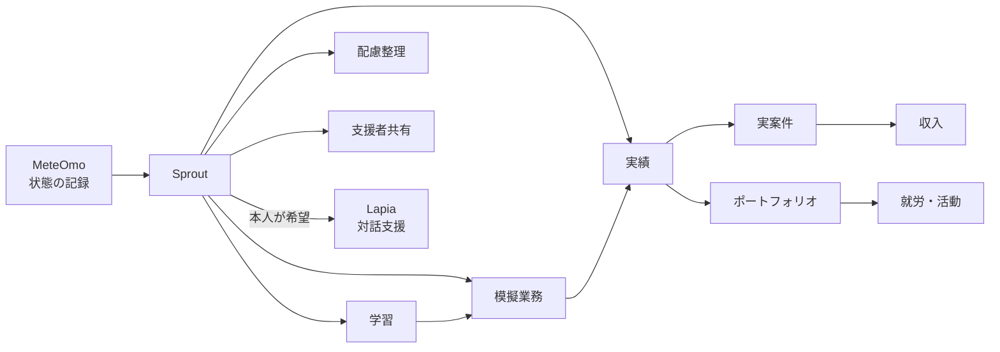

---
# 22. 開発ロードマップ
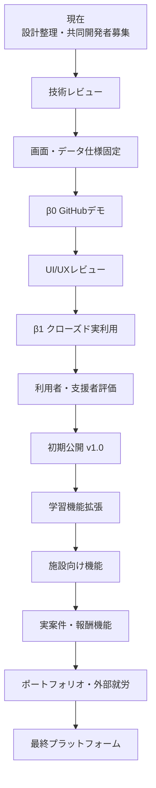

---
# 23. 2026年8月時点の開発前ロードマップ
| 項目                       | 状態                 |
| -------------------------- | -------------------- |
| 製品目的                   | 整理済み             |
| 施設間機会格差の縮小       | 製品目標として明文化 |
| 開発体制                   | 共同開発者募集段階   |
| React Native採用           | 第一候補／要技術確認 |
| TypeScript                 | 第一候補             |
| iOS初期公開                | 第一候補             |
| Android                    | 将来候補             |
| β0                         | 設計済み／未実装     |
| β1                         | 設計済み／未実装     |
| 利用者モード               | β1予定               |
| 進行ペース自己指定 | β1予定／初期版候補 |
| タスク分割・部分達成記録 | β0・β1予定 |
| せかさない通知・期限調整 | β1予定／初期版候補 |
| 支援者モード               | β1予定               |
| 模擬タスク                 | β0・β1予定           |
| 施設・職場タスク管理       | β1簡易版／初期版候補 |
| 施設教材登録               | β1簡易版／初期版候補 |
| 外部学習結果登録           | β1／初期版候補       |
| 実績カード                 | β0・β1予定           |
| 配慮メモ                   | β1予定               |
| ポートフォリオ・目標シート | β1簡易版／初期版候補 |
| 工賃・収入個人管理         | β1簡易版／初期版候補 |
| 福祉制度簡易マップ         | 初期版候補           |
| PDF                        | β1・初期版候補       |
| MeteOmoモック連携          | β0予定               |
| MeteOmo選択共有            | β1候補／要技術決定   |
| 認証                       | β1前に決定           |
| バックエンド               | β1前に決定           |
| AI                         | β0では原則使用しない |
| 実求人・決済               | 将来候補             |
| 施設向け機能               | 将来候補             |

---
# 24. 現時点で未確定の主な事項
- React Nativeの具体的構成
- Expoを使うか
- iOS最低対応バージョン
- ローカルDB方式
- β1バックエンド
- 認証方式
- 招待方式
- 支援者の本人確認
- データ暗号化
- サーバー保存地域
- バックアップ方式
- MeteOmoとの共有方式
- PDF最終仕様
- β参加人数
- 通知方式
- 進行ペースの選択肢・名称
- ペース設定によるタスク分割ロジック
- 支援者へのペース共有範囲
- 外部期限と本人ペースが合わない場合の調整UI
- オフライン同期
- 施設教材・タスク登録の権限設計
- 施設・職場タスクのやり取り保存方式
- 外部学習結果の証跡・確認方式
- 福祉制度簡易マップの情報源・更新方式
- 施設導入方式
- 公開求人マーケットの契約・決済
- 工賃・報酬の施設連携方式
- 他施設工賃・一般単価比較のデータ源
- ポートフォリオ公開方式
- AI導入の有無
- Lapia連携方式

---
# 25. GitHub公開時の安全条件
β0へ以下を含めません。

- 実在個人情報
- 実在利用者情報
- 実在支援者情報
- 実在施設の内部情報
- 実健康情報
- 実MeteOmo記録
- 実求人
- 実決済情報
- APIキー
- シークレット
- 非公開の開発者情報
- 契約・個人的なやり取り

ダミーデータ候補：

- 架空利用者：5名程度
- 架空支援者：3名程度
- 架空施設：3施設程度
- 模擬タスク：20〜30件
- 模擬実績：10件程度
- 模擬MeteOmo共有：10件程度
- 模擬配慮メモ：10件程度

---
# 26. 維持する設計原則

今後機能が増えても、以下を基本原則として維持します。

1. **低負担**  
   体調・状況に応じて短時間でも利用できる。

2. **せかさない**  
   作業速度を競わせず、本人が指定した進行ペースを基本にする。期限がある場合も、圧迫ではなく相談・再調整の選択肢を示す。

3. **無理をさせない**  
   「休む」「途中で止める」「今日はここまで」を正常な選択として扱い、未達ペナルティを設けない。

4. **本人中心**  
   記録・共有・削除だけでなく、学習量・タスク分割・進行ペースも本人が選べる。

5. **自己肯定感・自己効力感を支える**  
   完了だけでなく、着手・部分達成・工夫・学習・配慮によって出来たことも記録し、「自分に何が出来るか」「どの条件なら出来るか」を本人が確認しやすくする。

6. **支援者の負担も減らす**  
   教材、記録、フィードバック、引き継ぎを支援する。

7. **施設による機会差を小さくする**  
   共通教材・模擬業務・実績形式を提供する。

8. **診断名より条件を見る**  
   「何が出来ないか」だけでなく「どの条件なら出来るか」を整理する。

9. **AIを判定者にしない**  
   能力・就労可否・医療・制度認定をAIに判断させない。

10. **MeteOmo連携は任意**  
    Sprout単体でも使える。

11. **健康情報を自動共有しない**  
    本人が共有項目を選択する。

12. **健康情報からペースを自動決定しない**  
    MeteOmo等から共有された情報は本人の振り返り材料とし、Sproutが「働く／休む」を自動決定しない。

13. **βと本番を混同しない**  
    β版では不特定多数向けの求人仲介・Sprout内決済を扱わない。

14. **センシティブデータを主要収益源にしない**  
    広告・データ販売のために健康・心理情報を収集しない。

15. **学習・仕事の入口を一つに限定しない**  
    Sprout内教材だけでなく、施設教材・外部学習・施設や職場のタスクも本人の実績へまとめられるようにする。

16. **本人が収入を確認できる**  
    工賃・収入は施設だけが管理する情報にせず、本人が日々確認できる個人管理機能を持つ。

17. **速さを価値にしない**  
    速く終わることだけを成功とせず、理解・継続・工夫・休息・配慮を含めて本人の活動を記録する。

18. **将来機能を初期版へ勝手に混在させない**  
    公開求人市場、決済、研究、AI、外部API連携等は個別に安全性・法令・運用を確認する。

---
# 27. 2026年8月版の初期機能全体フロー

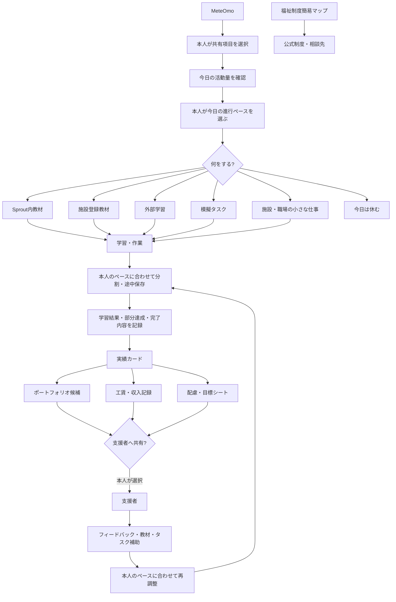

初期版では、**学習・仕事・実績・収入・支援情報を本人の画面でつなげ、進める速度と共有範囲を本人が選べること**を中心とします。

「休む」「途中まで」「少しだけ進める」も通常の利用経路として扱います。

---
# 28. 文書上の位置づけ
この資料は、Sproutの初期構想から2026年8月時点の開発前仕様までを、一般公開用に整理したものです。

- 現在は開発前・共同開発者募集段階です。
- React Native等の技術構成は第一候補であり、共同開発開始時に変更される可能性があります。
- β0・β1は計画であり、実装済み機能ではありません。
- 将来候補・長期構想は実装を保証するものではありません。
- MeteOmoとの連携は本人同意・選択共有を前提とし、健康データの自動共有は前提としません。
- Sproutは医療、診断、服薬判断、障害認定、福祉制度の受給可否、就労可否を判定しません。
- β版では不特定多数向けの求人仲介・Sprout内決済は行いません。一方、施設・職場から本人へ既に提供された小さな仕事をタスクとして登録・管理する簡易機能はβ1候補に含めます。
- 公開資料には共同開発者等の個人情報を掲載しません。
- Sproutは「速く進めること」を利用者評価の中心にせず、本人が進行ペースを自己指定できる設計を基本とします。
- 休息・途中終了・部分達成を失敗として扱わず、出来たことや出来た条件を残すことで自己肯定感・自己効力感を支える方向とします。
- 外部期限がある仕事でも、急かす表示ではなく、作業分割・支援者相談・期限や作業量の再調整へつなぐ方向とします。

---
## 関連資料
- `README.md` — Sproutの目的・基本方針・主要機能
- `LICENSE.md` — Sprout Custom License
- 旧Sprout設計資料 — 初期構想・旧β安全版
- MeteOmo現行設計資料 — セルフモニタリング・連携元
- 今後作成予定：βテスト仕様
- 今後作成予定：プライバシーポリシー
- 今後作成予定：データ仕様書
- 今後作成予定：共同開発向けIssue一覧

---
## 更新内容（2026-08-28 追記）

- 「せかさない・無理をさせない・本人のペースを優先する」を基本設計原則として追加
- 利用者が進行ペースを自己指定できる設計を追加
- デフォルトペースと当日変更の考え方を追加
- 「休む」「途中まで」「部分達成」を正常な状態として扱う方針を追加
- 支援者が本人のペースを一方的に変更・評価しない方針を追加
- 出来たこと・工夫・必要な配慮を可視化し、自己肯定感／自己効力感につなげる設計を追加
- 外部期限がある仕事では、急がせるのではなくタスク分割・相談・期限調整へつなぐ方針を追加
- 添付版で修正されていた学習カテゴリ、施設教材、外部学習、小さな仕事、ポートフォリオ、工賃・収入管理等の内容を維持

---

**Last Updated: 2026-08-28**
